# Nissan Silvia S15 Spec R for Roblox

A Nissan Silvia S15 Spec R built in Blender for Roblox: JDM right-hand drive, Lightning Yellow, stock 17" five-spoke wheels at factory ride height, factory Spec R aero, and a full SR20DET engine bay. Doors, bonnet and boot open, the lights work, and the parts are laid out for **A-Chassis**.

The outer body shape comes from an AI 3D reconstruction of a stock car (Tripo, run on Higgsfield from AI reference photos), fitted to the real S15's dimensions. Everything that has to work in Roblox is modelled by the generator script: the opening panels, glass, lights, interior, engine bay, wheels and underbody. See [How the body was made](#how-the-body-was-made).

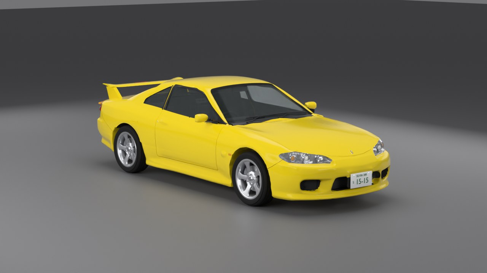

| | |
|---|---|
| 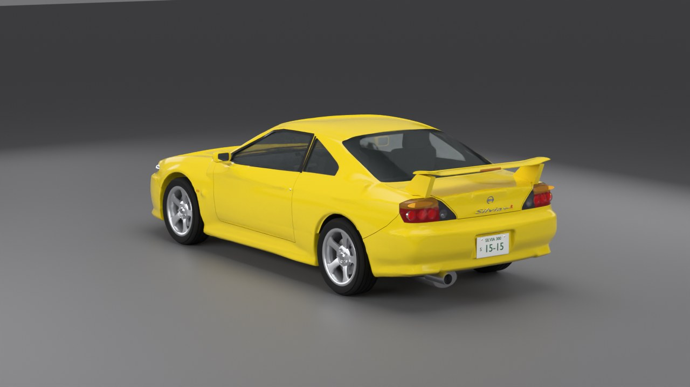 | 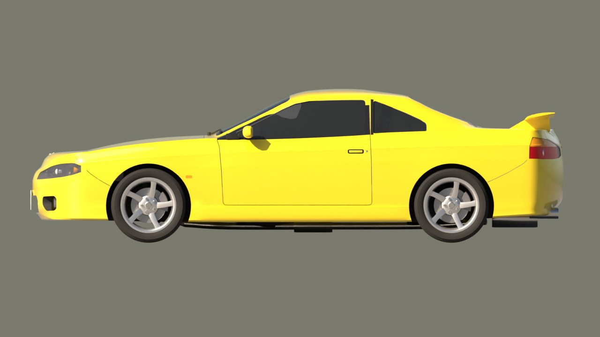 |
| 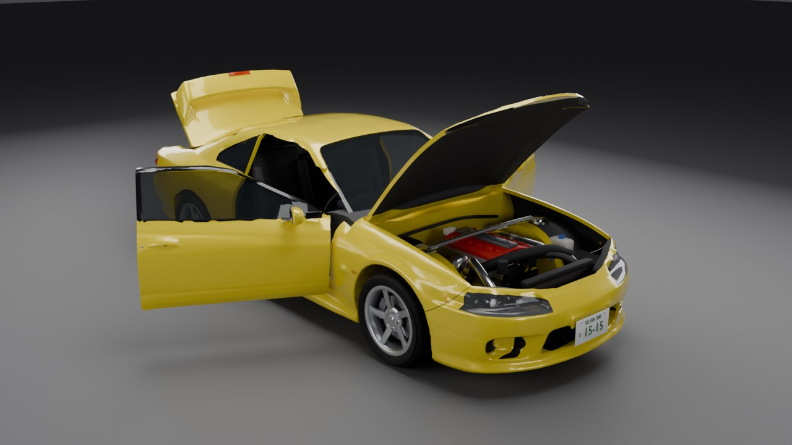 | 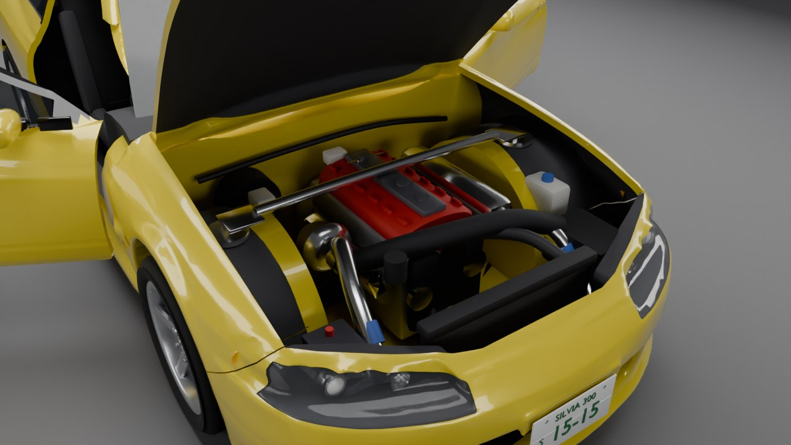 |
| 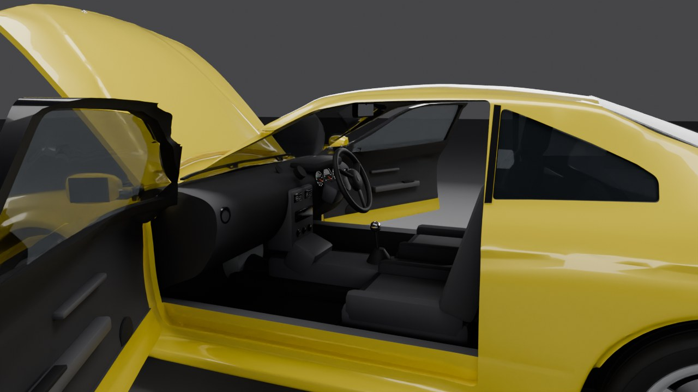 | 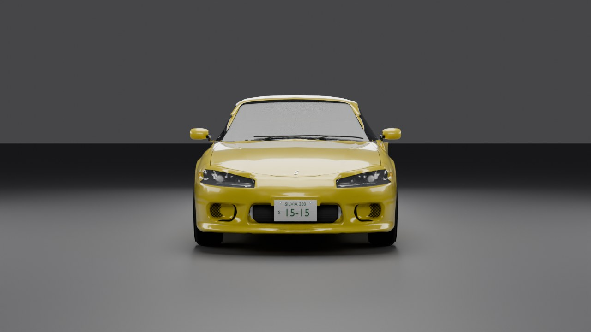 |

## What's in the model

* **Body**: the reconstructed S15 shell, scaled to real S15 dimensions (4445 × 1695 × 1285 mm, 2525 mm wheelbase, 1470/1460 mm track) with the wheels on the real axle lines. It's hollow, with a real cabin, engine bay and boot. The panel gaps for the doors, bonnet and boot are cut where those panels split, plus the bumper seams and a fuel flap on the right rear quarter.
* **Opening panels**: both doors, the bonnet and the boot are separate parts with hinge data. The door glass, mirrors, door cards and handles move with the doors. The Spec R wing, its stop lamp and the badges move with the boot lid.
* **Lights**: the lamp openings were measured on the reconstruction's own texture, so they sit where its surfacing expects them. The headlights are chrome-lined housings with a high-beam bowl, a projector and an amber indicator bowl, each with a chrome bezel, behind a clear lens. The tail lights are smoked units. The amber indicator band runs along the top, over an oval amber reflector. Below it are three round red tail/brake bulbs and a clear reverse lamp at the pointed inner end. There are also side repeaters, plate lamps, the wing stop lamp and dash needles, and each one is its own `Light_*` part.
* **Exterior**: the stock Spec R wing (a thin blade on two swept pedestals, with the stop lamp in its trailing edge), a horizontal-slat centre grille with the intercooler behind it, black-lined bumper openings with honeycomb mesh in the outer ones, a black scuttle panel, aero door mirrors, flap door handles with key locks, black B-pillars and window frames, wipers, a single exhaust on the left, and JDM plates front and rear. The badges are an "S" on the bonnet, plus a Nissan roundel, a "Silvia" script and "Spec R" with a red R on the boot, all at their real size.
* **Interior (RHD)**: dashboard with the gauge binnacle and three dials, a boost gauge pod, centre stack with head unit, climate dials and vents, steering column and three-spoke wheel, pedals, centre console with gear lever and handbrake over the transmission tunnel, front bucket seats with bolsters and inserts, the 2+2 rear bench, door cards, headliner, sun visors, rear-view mirror, floor mats, parcel-shelf speakers, and a spare wheel in the boot.
* **SR20DET bay**: red twin-cam valve cover with coil packs, intake plenum and runners, T28 turbo with downpipe, front-mount intercooler and piping, radiator, fan and hoses, air box, battery, fuse box, reservoirs, brake booster and master cylinder (driver's side), strut tops and a strut-tower bar, and a wiring loom.
* **Wheels**: 215/45R17 tyres with tread grooves and shoulder blocks; 17x7 rims with five broad, slightly twisted spokes that flare out towards the rim and a concave face, five lug nuts, a centre cap and a valve stem; plus discs and calipers.
* **Paint**: a vivid Lightning Yellow solid colour under a clear coat. The previews use Blender's *Standard* view transform, because *AgX* washes yellow out towards cream.
* **Underbody**: suspension arms, coilovers, half shafts, the R200 diff, driveshaft, gearbox, fuel tank and the full exhaust run.

**Size:** 109 MeshParts and about 192k triangles (191,738). The largest single part has 11,432, under Roblox's 20k-per-mesh cap. The full list is in [`export/parts.txt`](export/parts.txt). The body shell is 55k of those triangles. For a lighter car, lower `BODY_TRIS` near the top of the script and re-run `--prepare-body` (see [Changing it](#changing-it)).

## How the body was made

### 1. Reference photos

The images in [`refs/`](refs) were made with Higgsfield (GPT Image 2.5). First a studio front three-quarter master shot. Then side, front, rear three-quarter and straight rear views were generated from that master so the car stays consistent. There's also one hero shot on a mountain pass at golden hour.

| | |
|---|---|
| 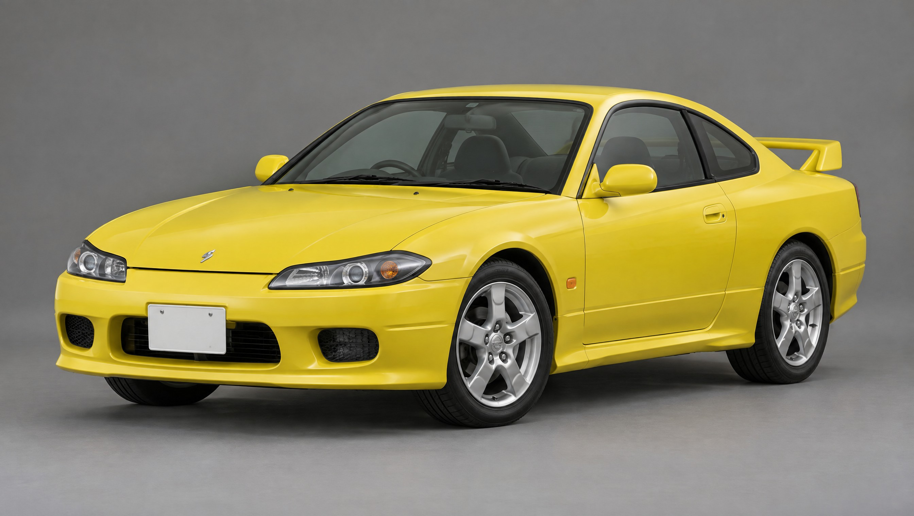 | 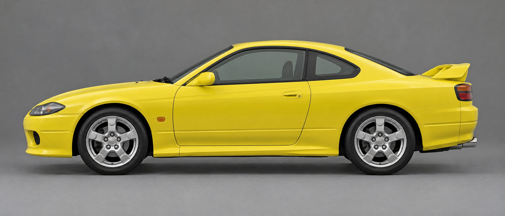 |
| 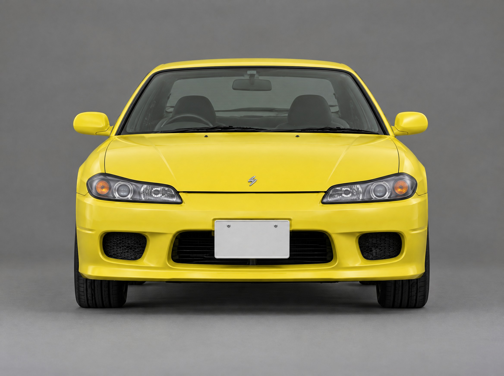 | 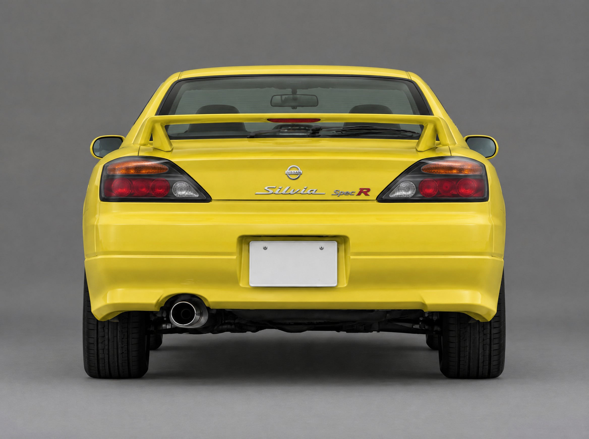 |

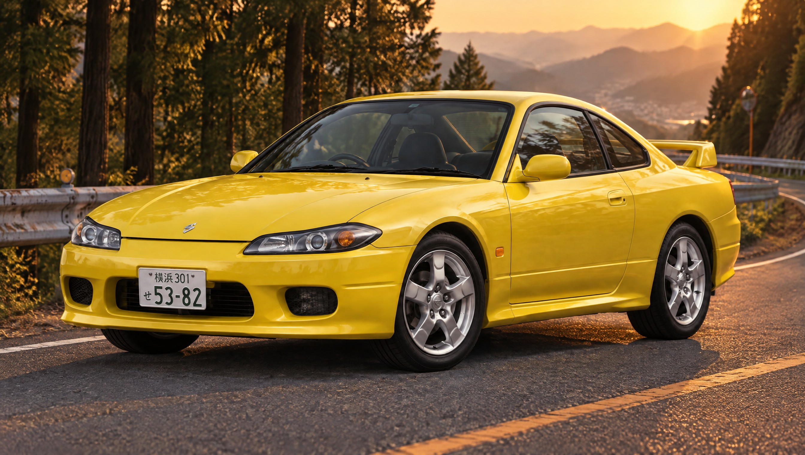

### 2. AI 3D models

Two image-to-3D models were tried on Higgsfield:

* **Hunyuan3D v3**, from the master photo alone.
* **Tripo H3.1 multiview**, from four views in order: front, left side, rear, and the left side mirrored as the right side.

Tripo's model was clearly better, especially at the rear, which Hunyuan had to guess. Tripo's is the one used.

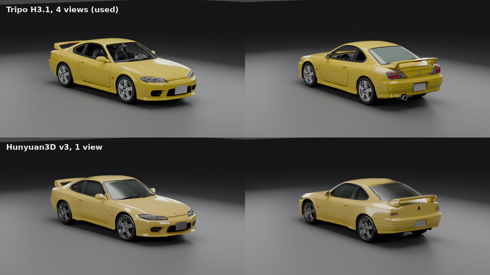

### 3. Turning it into a car body

The raw model is a single 1.9-million-triangle mesh. It has the wheels, wing, mirrors, wipers and exhaust moulded on, open windows, and a rough interior. `s15_spec_r.py --prepare-body` turns it into [`body/s15_body.glb`](body) (55k triangles, 1 MB), which the build then loads:

1. **Fit.** It's turned the right way round. The axles are found from the tyre contact patches and placed on the real wheelbase. The overhangs, width and height are scaled to the real car.
2. **Symmetry.** The right half is kept and mirrored. This also drops the AI exhaust, because the script adds the stock one.
3. **Close the cabin.** The open windows and cabin are filled with the script's own lofted body, pulled onto the reconstruction's window frames (the window areas are filled in smoothly). That way the usual cavities can hollow it out, and the glass gets a surface that spans the frames.
4. **Seal.** The shape is rebuilt from its signed distance field (OpenVDB grid nodes) with a 1 cm closing. This makes it watertight and fills the AI's own panel-line grooves, because the real panel gaps are cut later where the panels actually split.
5. **Strip parts the script adds.** The moulded wheels, mirrors, wipers and wing are cut off. The AI wing was too chunky, so the script models the stock one instead. Under the wing's feet, the boot-lid height is rebuilt from a smooth fit to the rest of the lid.
6. **Smooth.** Taubin smoothing (which doesn't shrink the shape) runs on the dense mesh. The shape is then rebuilt from the distance field once more and reduced to 55k triangles. Next, the bonnet, roof, boot lid and the tail panel between the lights are pulled onto smooth surfaces fitted to them. That removes the millimetre-scale lumps that glossy paint shows up. Any spot where smoothing folded a thin lip through itself is put back, because the exact booleans fail on self-intersecting meshes.

After that, the body goes through the same cuts as before: windows, lamps, intakes, cabin/bay/boot cavities, and the door, bonnet and boot splits. The inner offsets for the cavities and panel skins also come from the distance field, so they can't fold over.

### 4. Checking it against the references

The comparison cameras were fitted to the reference photos, not placed by eye. Their position, angle, focal length and lens shift were optimised until the model's silhouette matched the car's outline in each photo. The overlap is 78% front and 79% rear; most of the rest is the windows, which the photo outline leaves out. The model was then rendered from those cameras ([`previews/compare_reference.jpg`](previews/compare_reference.jpg)). Its silhouette was also rendered at the side photo's pixel scale and drawn over it ([`previews/side_overlay.jpg`](previews/side_overlay.jpg), model in red).

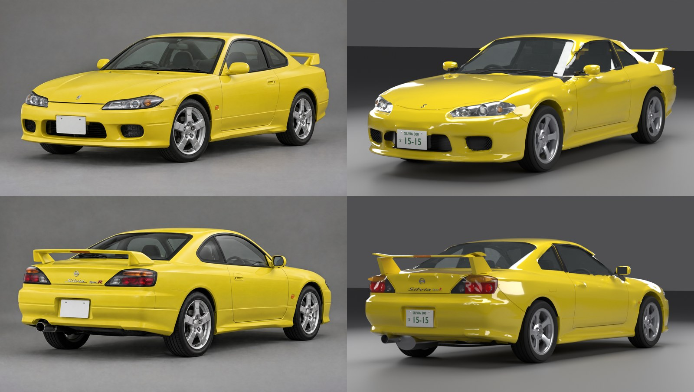

The model keeps the real 4445 mm length and 975 mm front overhang. The AI side photo draws the front overhang about 13 cm shorter, so the bumpers extend past it in the overlay.

**Credits used:** 39 Higgsfield credits in total. 5 for the first reference set, then 1 for the rear view, 15 for Hunyuan3D and 18 for Tripo.

## Files

| File | What it is |
|---|---|
| `export/S15_SpecR_Roblox.fbx` | **Import this into Roblox.** 1 unit = 1 stud, so the car is 15.9 studs long. |
| `export/S15_Setup.lua` | Command-bar script that sets up the imported car (see below). |
| `export/S15_SpecR.blend` | Editable Blender scene at real scale, in metres. |
| `export/S15_SpecR.glb` | glTF copy, in metres. |
| `export/parts.txt` | Every part with its assembly, material and triangle count. |
| `s15_spec_r.py` | The generator. Re-run it to rebuild everything. |
| `body/s15_body.glb` | The prepared body shape the generator loads. |
| `refs/` | The Higgsfield reference images. |
| `previews/` | Renders of the model, the raw AI models, the reference comparison and the side overlay. |

## Putting it in Roblox

1. **Import.** Go to *Home → Import 3D* and pick `S15_SpecR_Roblox.fbx`. Under *File Transform*, set **Scale Unit = Stud**, **World Forward = Front** and **World Up = Top**. These are Roblox's own recommended settings for Blender files. The car should come in about 15.9 studs long.
2. **Set up.** Select the imported model in the Explorer. Open *View → Command Bar*, paste in all of `export/S15_Setup.lua`, and press Enter. The script:
   * sets the material, colour, transparency and reflectance of every part;
   * builds the A-Chassis layout: `Body`, `Wheels/FL, FR, RL, RR` (each has an invisible cylinder wheel, with `Parts` for the tyre, rim and disc and `Fixed` for the caliper), `Misc/Door_L, Door_R, Hood, Trunk, SteeringWheel`, plus a right-hand-drive `DriveSeat` and a passenger `Seat`;
   * adds open/close prompts (key **F**) to both doors, the bonnet and the boot;
   * adds two server scripts (`S15_Panels`, `S15_Lights`), a `S15_LightEvent` RemoteEvent, and an A-Chassis plugin.
   It works out the car's orientation and scale from the four tyres, so it still works if the import was rotated or scaled.
3. **Chassis.** Drop your **A-Chassis Tune** into the new model, as you would with any A-Chassis car. Then move **`S15 Lights Plugin`** from the folder *"Move into A-Chassis Tune > Plugins"* into `A-Chassis Tune/Plugins`.
4. Everything is left anchored with CanCollide off, which is how A-Chassis expects a car before it initialises.

### Controls (from the plugin)

| Key | Action |
|---|---|
| L | Headlights, tail lights, plate lamps and dash lights |
| Z / C | Left / right indicator |
| X | Hazards |
| F (near a panel) | Open or close a door, the bonnet or the boot |

Brake lights, reverse lights and the steering-wheel rotation follow A-Chassis' `Values` (Brake, Gear and SteerC) automatically. Without a chassis, you can drive the lights from any script by setting these attributes on the car model: `Headlights`, `Brake`, `Reverse`, `IndicatorLeft`, `IndicatorRight`, `Hazards`.

On a parked, anchored display car the panels animate with a tween. On a running A-Chassis car they swing on servo `HingeConstraint`s.

## Changing it

* **Paint:** set `PAINT` near the top of `s15_spec_r.py`. The presets are `lightning_yellow`, `pearl_white`, `sparkling_silver`, `brilliant_blue`, `super_black` and `active_red`. You can also just change the `Body_Paint`, `Door_*_Paint`, `Hood_Paint` and `Trunk_Paint` colours in Studio.
* **Rebuild:** run `blender --background --python s15_spec_r.py` (or `-- --out <folder>`). In the Blender UI, use *Scripting → Open → Run Script*, which builds into a new `S15_SpecR` scene.
* **Preview renders:** run `blender -b -P s15_spec_r.py -- --no-export --render --open --samples 64`.
* **Old lofted body:** add `-- --body loft` to build the earlier body, which is lofted from design curves instead of the AI shape.
* **Another AI model:** download the raw GLB and run `blender -b -P s15_spec_r.py -- --prepare-body raw.glb body/s15_body.glb`, then rebuild. The fit, cleanup, cabin fill and smoothing are automatic. A different model will probably need the outlines that were measured on this one adjusted. Those are the `BODY_MESH` branches of `plan_windshield`, `plan_backlight`, `trunk_outlines`, `head_front`/`head_plan`/`head_side`, `tail_rear`/`tail_plan`/`tail_side` and the intakes, plus `FAIR_PANELS`.

## Notes and limits

* The body is an AI reconstruction made from AI-generated photos, not a scan of a real car. It reads as an S15 from every angle, but small details are the AI's interpretation, and the 1 cm smoothing softens them further: the exact headlight and bumper surfacing, crease sharpness and the shape of the intakes.
* The bonnet, roof, boot lid and tail panel are faired onto smooth surfaces. The flanks and bumpers are only smoothed, so in a close-up with glossy paint you can still see faint ripples there from the reconstruction.
* Building with the AI body needs Blender 4.2's OpenVDB grid nodes (the script switches them on). On an older Blender, the script falls back to the lofted body.
* I couldn't open Roblox Studio here. The generated Luau, including the three scripts it creates, passes a type check against Roblox's API definitions (`luau-lsp`) and compiles, but it hasn't been run in Studio. A-Chassis builds also differ between versions. If yours already welds `Misc` or uses different `Values` names, adjust `S15_Panels` or the plugin to match.
* The first version of `S15_Setup.lua` had a bug that stopped it while building the wheels. If you ran that one, delete the model and run the current script on a fresh import.
* The calipers go in each wheel's `Fixed` model so they don't spin. If your A-Chassis version doesn't support `Fixed`, put them in `Parts` or weld them to the body.
* Stock S15 Spec Rs came with 16" or 17" wheels depending on the package. This one uses 17s (`TYRE_*` and `RIM_IN` in the script).

Reference dimensions: [auto-data.net](https://www.auto-data.net/en/nissan-silvia-s15-2.0-i-16v-t-250hp-automatic-24949), [carfromjapan.com](https://carfromjapan.com/specifications/nissan/silvia/581389f42afaa2c4b2869497), [supercars.net](https://www.supercars.net/blog/1999-nissan-silvia-spec-r/). Roblox import settings: [create.roblox.com/docs/art/blender](https://create.roblox.com/docs/art/blender). Reference images and the body reconstruction: generated with Higgsfield (GPT Image 2.5, Tripo H3.1) for this project.
