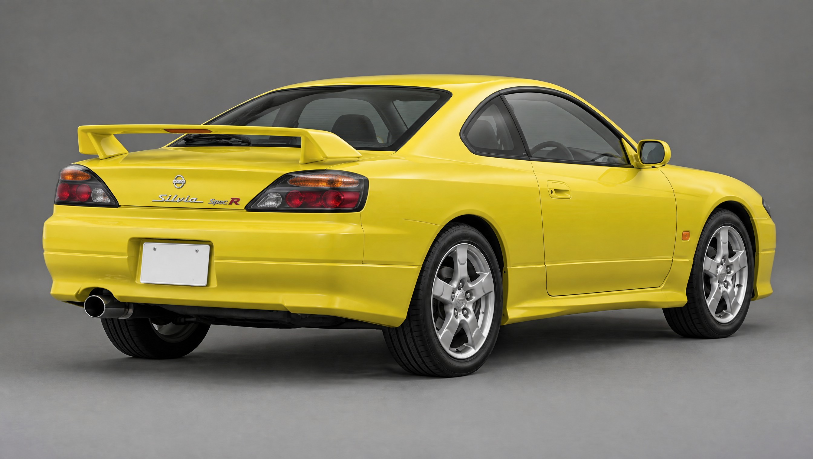

# Nissan Silvia S15 Spec R for Roblox

A Nissan Silvia S15 Spec R built in Blender for Roblox: JDM right-hand drive, Lightning Yellow, stock 17" five-spoke wheels at factory ride height, factory Spec R aero, and a full SR20DET engine bay. Doors, bonnet and boot open, the lights work, and the parts are laid out for **A-Chassis**. The body was refined against a set of AI-generated reference images of a bone-stock car (see [Reference images](#reference-images)).

| | |
|---|---|
|  |  |
|  |  |
|  |  |

## What's in the model

* **Body**: built to real S15 dimensions (4445 × 1695 × 1285 mm, 2525 mm wheelbase, 1470/1460 mm track). It's a hollow shell with a real cabin, engine bay and boot. It has panel gaps, the shoulder crease, side skirts, a fuel flap on the right rear quarter, a plate recess and a crease across the rear bumper. The roofline, glasshouse, bonnet, boot deck, sills and wheel arches follow the side reference.
* **Opening panels**: both doors, the bonnet and the boot are separate parts with hinge data. The door glass, mirrors, door cards and handles move with the doors. The rear wing, high-mount stop lamp and badges move with the boot lid.
* **Lights**: the headlights have chrome reflector bowls, a projector, a high beam and an amber indicator behind a clear lens. The tail lights are smoked units with an amber indicator strip along the top, two round red tail/brake bulbs, and a clear reverse section on the inner end. There are also side repeaters, plate lamps, the wing brake light and dash needles, and each one is its own `Light_*` part.
* **Exterior**: body-coloured bumpers with no lip or valance (bone stock), a horizontal-slat centre grille with the intercooler behind it, mesh in the outer openings, aero door mirrors, flap door handles with key locks, black B-pillars and window frames, wipers, the Spec R pedestal wing, a single exhaust on the left, and JDM plates front and rear. The badges are an "S" on the bonnet, plus a Nissan roundel, a "Silvia" script and "Spec R" with a red R on the boot.
* **Interior (RHD)**: dashboard with the gauge binnacle and three dials, a boost gauge pod, centre stack with head unit, climate dials and vents, steering column and three-spoke wheel, pedals, centre console with gear lever and handbrake over the transmission tunnel, front bucket seats with bolsters and inserts, the 2+2 rear bench, door cards, headliner, sun visors, rear-view mirror, floor mats, parcel-shelf speakers, and a spare wheel in the boot.
* **SR20DET bay**: red twin-cam valve cover with coil packs, intake plenum and runners, T28 turbo with downpipe, front-mount intercooler and piping, radiator, fan and hoses, air box, battery, fuse box, reservoirs, brake booster and master cylinder (driver's side), strut tops and a strut-tower bar, and a wiring loom.
* **Wheels**: 215/45R17 tyres with tread grooves and shoulder blocks; 17x7 rims with five wide, slightly twisted spokes and a concave face, five lug nuts, a centre cap and a valve stem; plus discs and calipers.
* **Underbody**: suspension arms, coilovers, half shafts, the R200 diff, driveshaft, gearbox, fuel tank and the full exhaust run.

**Size:** 103 MeshParts and 128,165 triangles. The largest single part has 16,847, under Roblox's 20k-per-mesh cap. The full list is in [`export/parts.txt`](export/parts.txt).

## Reference images

The images in [`refs/`](refs) were made with Higgsfield (GPT Image 2.5). First a studio front three-quarter master shot, then side, front and rear three-quarter views generated from that master so the car stays consistent, plus one hero shot on a mountain pass at golden hour. They cost 5 credits. A straight rear view was also requested, but Higgsfield refused it because the account had hit its daily generation limit, so the rear three-quarter view was used for the back of the car.

| | |
|---|---|
|  |  |
|  |  |

**How they were used.** The side view was scaled using the wheelbase. The model's outline was then rendered with an orthographic camera at the same scale and overlaid on the image ([`previews/side_overlay.jpg`](previews/side_overlay.jpg), model in red). The roof, windshield, bonnet, deck, wing and sills were adjusted until they matched within about 1–2 cm. The front view was measured on the bumper plane, scaled by the plate width, to place the headlights, intakes and plate. The rear three-quarter view set the tail-light layout and badges. The paint colour was sampled from the references. [`previews/compare_reference.jpg`](previews/compare_reference.jpg) puts the references and the model side by side:

**Where the model intentionally differs.** The AI side view draws the front overhang about 13 cm shorter (0.84 m) and the tail slightly shorter than a real S15. The model keeps the real 4445 mm length and 975 mm front overhang, so in the overlay its bumpers extend past the image at both ends.

## Files

| File | What it is |
|---|---|
| `export/S15_SpecR_Roblox.fbx` | **Import this into Roblox.** 1 unit = 1 stud, so the car is 15.9 studs long. |
| `export/S15_Setup.lua` | Command-bar script that sets up the imported car (see below). |
| `export/S15_SpecR.blend` | Editable Blender scene at real scale, in metres. |
| `export/S15_SpecR.glb` | glTF copy, in metres. |
| `export/parts.txt` | Every part with its assembly, material and triangle count. |
| `s15_spec_r.py` | The generator. Re-run it to rebuild everything. |
| `refs/` | The Higgsfield reference images. |
| `previews/` | Renders of the model, plus the reference comparison and side overlay. |

## Putting it in Roblox

1. **Import.** Go to *Home → Import 3D* and pick `S15_SpecR_Roblox.fbx`. Under *File Transform*, set **Scale Unit = Stud**, **World Forward = Front** and **World Up = Top**. These are Roblox's own recommended settings for Blender files. The car should come in about 15.9 studs long.
2. **Set up.** Select the imported model in the Explorer. Open *View → Command Bar*, paste in all of `export/S15_Setup.lua`, and press Enter. The script:
   * sets the material, colour, transparency and reflectance of every part;
   * builds the A-Chassis layout: `Body`, `Wheels/FL, FR, RL, RR` (each has an invisible cylinder wheel, with `Parts` for the tyre, rim and disc and `Fixed` for the caliper), `Misc/Door_L, Door_R, Hood, Trunk, SteeringWheel`, plus a right-hand-drive `DriveSeat` and a passenger `Seat`;
   * adds open/close prompts (key **F**) to both doors, the bonnet and the boot;
   * adds two server scripts (`S15_Panels`, `S15_Lights`), a `S15_LightEvent` RemoteEvent, and an A-Chassis plugin.
   It works out the car's orientation and scale from the four tyres, so it still works if the import was rotated or scaled.
3. **Chassis.** Drop your **A-Chassis Tune** into the new model, as you would with any A-Chassis car. Then move **`S15 Lights Plugin`** from the folder *"Move into A-Chassis Tune > Plugins"* into `A-Chassis Tune/Plugins`.
4. Everything is left anchored with CanCollide off, which is how A-Chassis expects a car before it initialises.

### Controls (from the plugin)

| Key | Action |
|---|---|
| L | Headlights, tail lights, plate lamps and dash lights |
| Z / C | Left / right indicator |
| X | Hazards |
| F (near a panel) | Open or close a door, the bonnet or the boot |

Brake lights, reverse lights and the steering-wheel rotation follow A-Chassis' `Values` (Brake, Gear and SteerC) automatically. Without a chassis, you can drive the lights from any script by setting these attributes on the car model: `Headlights`, `Brake`, `Reverse`, `IndicatorLeft`, `IndicatorRight`, `Hazards`.

On a parked, anchored display car the panels animate with a tween. On a running A-Chassis car they swing on servo `HingeConstraint`s.

## Changing it

* **Paint:** set `PAINT` near the top of `s15_spec_r.py`. The presets are `lightning_yellow`, `pearl_white`, `sparkling_silver`, `brilliant_blue`, `super_black` and `active_red`. You can also just change the `Body_Paint`, `Door_*_Paint`, `Hood_Paint` and `Trunk_Paint` colours in Studio.
* **Rebuild:** run `blender --background --python s15_spec_r.py` (or `-- --out <folder>`). In the Blender UI, use *Scripting → Open → Run Script*, which builds into a new `S15_SpecR` scene.
* **Preview renders:** run `blender -b -P s15_spec_r.py -- --no-export --render --open --samples 64`.

## Notes and limits

* The model is generated from code: lofted cross-sections plus exact booleans. It isn't a scan. The side profile now closely matches the reference. The headlight and tail-light outlines, the bumper openings, the wing and the stance are close too. The finer surfacing is still an approximation, especially how the nose rounds into the headlights and how deep the lamps look.
* With the bonnet open, a few thin dark slivers show along its front edge near the headlight pockets.
* I couldn't open Roblox Studio here. The generated Luau, including the three scripts it creates, passes a type check against Roblox's API definitions (`luau-lsp`) and compiles, but it hasn't been run in Studio. A-Chassis builds also differ between versions. If yours already welds `Misc` or uses different `Values` names, adjust `S15_Panels` or the plugin to match.
* The previous version of `S15_Setup.lua` had a bug: a loop variable reused the name of the scale factor, so it stopped with an error while building the wheels. This version fixes it. If you ran the old one, delete that model and run the new script on a fresh import.
* The calipers go in each wheel's `Fixed` model so they don't spin. If your A-Chassis version doesn't support `Fixed`, put them in `Parts` or weld them to the body.
* Stock S15 Spec Rs came with 16" or 17" wheels depending on the package. This one uses 17s (`TYRE_*` and `RIM_IN` in the script).

Reference dimensions: [auto-data.net](https://www.auto-data.net/en/nissan-silvia-s15-2.0-i-16v-t-250hp-automatic-24949), [carfromjapan.com](https://carfromjapan.com/specifications/nissan/silvia/581389f42afaa2c4b2869497), [supercars.net](https://www.supercars.net/blog/1999-nissan-silvia-spec-r/). Roblox import settings: [create.roblox.com/docs/art/blender](https://create.roblox.com/docs/art/blender). Reference images: generated with Higgsfield for this project.
